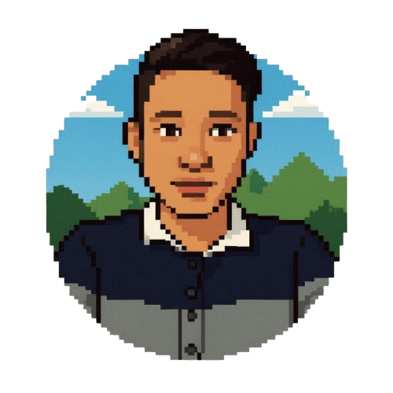

# Lufutu.com - Retro Windows Portfolio

A nostalgic Windows 95/98-inspired portfolio website built with Next.js, React, TypeScript, and TailwindCSS. Experience the charm of the classic Windows interface with modern web technologies.



## 🌟 Features

### 🖥️ Classic Windows Interface
- Authentic Windows 95/98 look and feel
- Interactive desktop with draggable icons
- Working taskbar with start menu
- Window management system
- Context menus (right-click functionality)

### 🎮 Built-in Games
- Snake
- Pong
- Breakout
- Memory Game

### 🎯 Widgets
- Clock Widget
- System Monitor
- Weather Widget
- Spotify Widget
- Notes Widget
- Habit Tracker
- Hit Counter
- Social Links

### 🎨 Design Features
- Retro pixel art aesthetics
- Dithering patterns
- Custom window decorations
- Animated transitions
- Multiple background options

## 🚀 Getting Started

### Prerequisites
- Node.js 18+ or Bun
- Git

### Installation

1. Clone the repository:
```bash
git clone https://github.com/lufutu/lufutu.com.git
cd lufutu.com
```

2. Install dependencies:
```bash
# Using npm
npm install

# Using Bun (recommended)
bun install
```

3. Start the development server:
```bash
# Using npm
npm run dev

# Using Bun
bun dev
```

4. Open [http://localhost:3000](http://localhost:3000) in your browser

## 🛠️ Built With

- [Next.js 14](https://nextjs.org/) - React Framework
- [TypeScript](https://www.typescriptlang.org/) - Type Safety
- [TailwindCSS](https://tailwindcss.com/) - Styling
- [Shadcn/ui](https://ui.shadcn.com/) - UI Components
- [Radix UI](https://www.radix-ui.com/) - Accessible Components

## 📱 Features in Detail

### System Monitor Widget
- Real-time system information display
- CPU, RAM, and Disk usage monitoring
- Auto-updates every 3 seconds
- Fallback to simulated data if needed

### Window Management
- Drag and drop windows
- Minimize/Maximize/Close functionality
- Window focus management
- Z-index ordering

### Game Center
- Multiple classic games
- High score tracking
- Pixel-perfect controls
- Retro sound effects

### Habit Tracker
- Daily habit tracking
- Progress visualization
- Persistent storage
- Achievement system

## 🎨 Customization

### Backgrounds
The project includes various pixel art backgrounds located in `public/assets/backgrounds/`. To change the background:

1. Add your background image to the backgrounds folder
2. Update the background selection in the settings

### Icons
Custom desktop icons can be added by:

1. Adding icon images to `public/assets/icons/`
2. Updating the icon configuration in `lib/window-content.ts`

## 📝 License

This project is licensed under the MIT License - see the LICENSE file for details.

## 🤝 Contributing

Contributions are welcome! Please feel free to submit a Pull Request.

## 📧 Contact

Your Name - [@yourusername](https://twitter.com/yourusername)

Project Link: [https://github.com/yourusername/lufutu.com](https://github.com/yourusername/lufutu.com)

## 🙏 Acknowledgments

- Inspired by Windows 95/98 UI
- Pixel art backgrounds from various artists
- [AdamCYounis](https://lospec.com/adamcyounis) color palettes
- All the amazing open-source libraries used in this project
